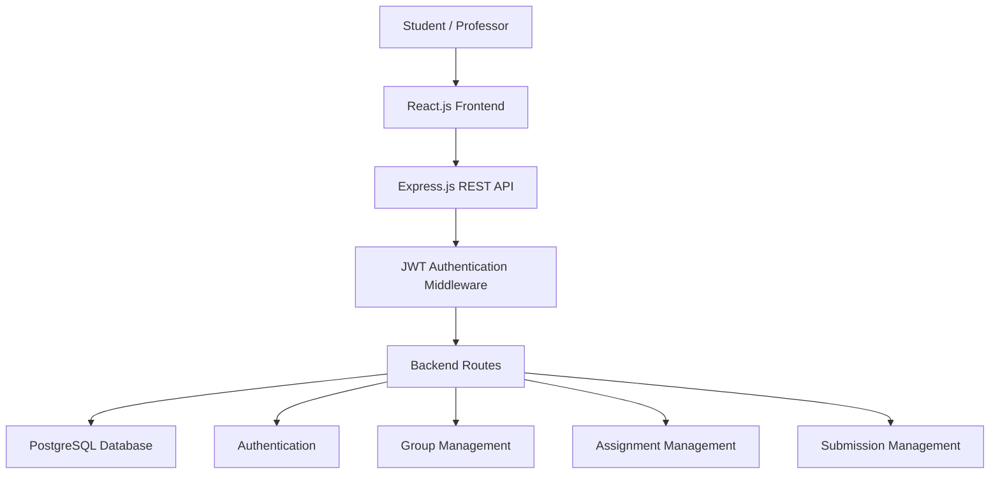

# System Architecture

```mermaid
flowchart TD
    A[Student / Professor] --> B[React.js Frontend]
    B --> C[Express.js REST API]
    C --> D[JWT Authentication Middleware]
    D --> E[Backend Routes]
    E --> F[PostgreSQL Database]

    E --> G[Authentication]
    E --> H[Group Management]
    E --> I[Assignment Management]
    E --> J[Submission Management]
```
