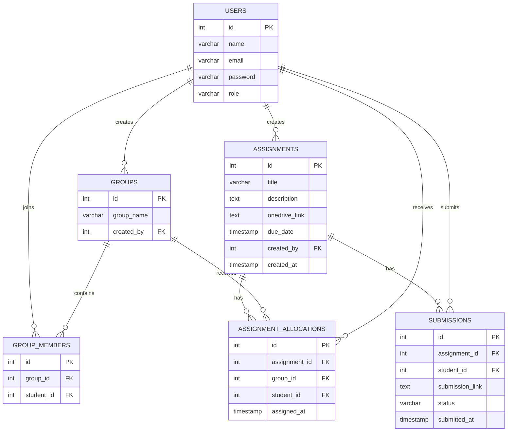

# Database ER Diagram

```mermaid
erDiagram
    USERS ||--o{ GROUPS : creates
    USERS ||--o{ GROUP_MEMBERS : joins
    GROUPS ||--o{ GROUP_MEMBERS : contains
    USERS ||--o{ ASSIGNMENTS : creates
    ASSIGNMENTS ||--o{ ASSIGNMENT_ALLOCATIONS : has
    GROUPS ||--o{ ASSIGNMENT_ALLOCATIONS : receives
    USERS ||--o{ ASSIGNMENT_ALLOCATIONS : receives
    ASSIGNMENTS ||--o{ SUBMISSIONS : has
    USERS ||--o{ SUBMISSIONS : submits

    USERS {
        int id PK
        varchar name
        varchar email
        varchar password
        varchar role
    }

    GROUPS {
        int id PK
        varchar group_name
        int created_by FK
    }

    GROUP_MEMBERS {
        int id PK
        int group_id FK
        int student_id FK
    }

    ASSIGNMENTS {
        int id PK
        varchar title
        text description
        text onedrive_link
        timestamp due_date
        int created_by FK
        timestamp created_at
    }

    ASSIGNMENT_ALLOCATIONS {
        int id PK
        int assignment_id FK
        int group_id FK
        int student_id FK
        timestamp assigned_at
    }

    SUBMISSIONS {
        int id PK
        int assignment_id FK
        int student_id FK
        text submission_link
        varchar status
        timestamp submitted_at
    }
```

